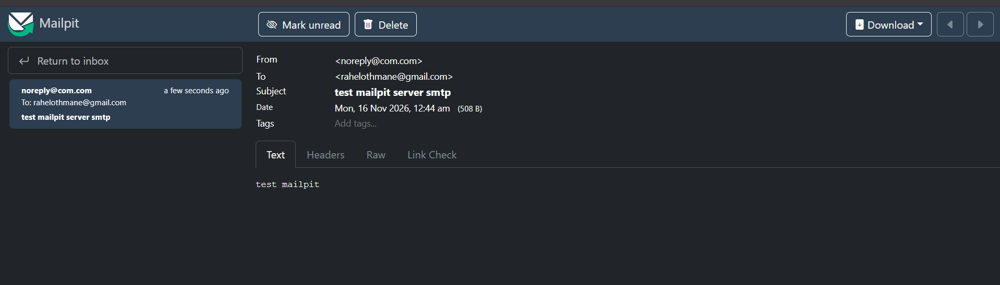

# Jalon V5 - Service Notification

## 1. Configuration du serveur SMTP local avec Mailpit

Après l'ajout de la dépendance **Java Mail Sender**, nous avons installé un serveur SMTP local à l'aide de **Mailpit** via Docker :

```bash
docker run -d --name mailpit \
-p 127.0.0.1:1025:1025 \
-p 127.0.0.1:8025:8025 \
axllent/mailpit
```

Une fois le conteneur démarré, l'interface web de Mailpit sur **http://localhost:8025** qui permet de visualiser les emails envoyés par l'application.



---

## 2. Configuration du broker RabbitMQ

Après l'ajout de la dépendance **Spring for RabbitMQ** avec son interface d'administration :

```bash
docker run -d --name rabbitmq \
-p 127.0.0.1:5672:5672 \
-p 127.0.0.1:15672:15672 \
-e RABBITMQ_DEFAULT_USER=tp \
-e RABBITMQ_DEFAULT_PASS=tp123 \
-v tp-rabbitmq-data:/var/lib/rabbitmq \
rabbitmq:4-management
```

L'interface d'administration RabbitMQ est accessible sur le port **http://localhost:15672**.

---

## 3. Test de l'envoi d'emails via Swagger UI

Après la configuration du service d'envoi d'emails, nous avons testé l'API à l'aide de **Swagger UI** afin de vérifier le bon fonctionnement de l'envoi des messages vers le serveur SMTP Mailpit.

job-tracker-app/test-swagger.png

### Dépendance Swagger utilisée

```xml
<dependency>
    <groupId>org.springdoc</groupId>
    <artifactId>springdoc-openapi-starter-webmvc-ui</artifactId>
    <version>3.2.0</version>
</dependency>
```

---

## 4. Communication asynchrone avec RabbitMQ

Après la configuration de **RabbitMQ**, de la classe **RabbitConfig** et de **RabbitTemplate**, nous avons mis en place la communication asynchrone entre les services.

Lors de la création d'une candidature, un message est publié dans RabbitMQ afin d'être traité par le service de notification.

Test de l'API de création d'une candidature :

job-tracker-app/test-api.png

---

## 5. Résultat final

Une fois la candidature créée, le message est envoyé à RabbitMQ puis consommé par le service de notification, qui génère et envoie un email de confirmation au candidat via Mailpit.

job-tracker-app/candidature-cree.png


